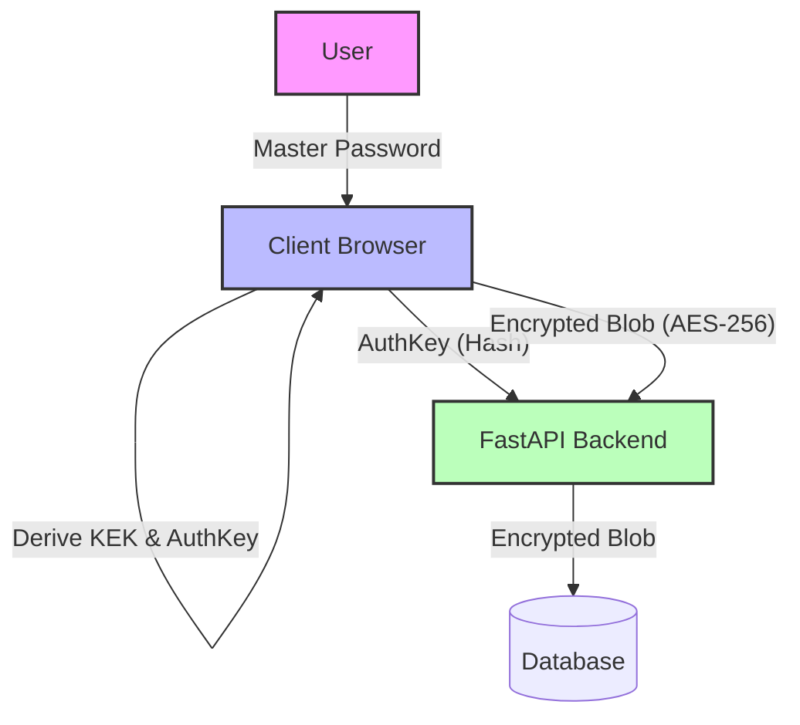

# ValutX - Next-Generation Zero-Knowledge Password Manager

> **Status:** 🚧 **In Active Development** (MVP Complete. Refining UI & Advanced Features)

## 🛡️ Project Overview

ValutX is a security-first, full-stack web application that demonstrates a **Zero-Knowledge Architecture**. Unlike traditional web apps, ValutX performs all cryptographic operations (Encryption, Decryption, Key Derivation) entirely in the browser. 

**The server never sees:**
- Your Master Password
- Your Encryption Keys
- Your Plaintext Data (Passwords, Cards, Notes)

The backend acts solely as a "blind" storage provider, synchronizing encrypted data blobs across devices.

## 🚀 Core Features

-   **Zero-Knowledge Security:** Data is encrypted/decrypted only on the client device.
-   **Military-Grade Encryption:** Uses **AES-256-GCM** for data and **PBKDF2/Argon2** for key derivation.
-   **Security-First Architecture:** Key Encryption Keys (KEK) and Data Encryption Keys (DEK) are separated to allow safe password changes and secure syncing.
-   **Modern Tech Stack:** Built with React/Vite (Frontend) and FastAPI (Backend) for high performance.
-   **Panic Mode:** A dedicated feature to instantly wipe decrypted data from browser memory.
-   **Rich UI/UX:** A premium, dark-mode capability with glassmorphism effects.

## 🛠️ Tech Stack

### Frontend (Client-Side)
-   **Framework:** React 18 + Vite
-   **Language:** TypeScript
-   **Styling:** Tailwind CSS (Custom Design System)
-   **Cryptography:** Web Crypto API (Native Browser Standards)
-   **State:** Zustand (for transient secure memory storage)

### Backend (Server-Side)
-   **Framework:** FastAPI (Python 3.10+)
-   **Database:** PostgreSQL / SQLite
-   **Authentication:** JWT (Access/Refresh Tokens) - *Authentication only, no decryption capability*
-   **Validation:** Pydantic

## 🏗️ Architecture

The system follows a "Thick Client" cryptography model:



### Key Management Flow
1.  **Master Password** is input by user.
2.  **Auth Key** is derived (PBKDF2) and sent to server for login.
3.  **Key Encryption Key (KEK)** is derived independently from Master Password.
4.  **Data Encryption Key (DEK)** is unwrapped using KEK.
5.  **Vault Items** are encrypted/decrypted using the DEK.

## 📂 Project Structure

```bash
ValutX/
├── frontend/        # React + Vite Frontend
│   ├── src/
│   │   ├── components/  
│   │   ├── pages/       
│   │   ├── store/       
│   │   ├── utils/       # Client-side Crypto (crypto.ts)
│   │   └── App.tsx
│   ├── public/
│   └── package.json
├── backend/         # FastAPI Backend
│   ├── app/
│   │   ├── api/     
│   │   ├── schemas/ 
│   │   └── core/    
│   ├── main.py      
│   └── requirements.txt
├── ARCHITECTURE.md
└── README.md
```

## ⚡ Getting Started

### Prerequisites
-   Node.js 18+
-   Python 3.10+

### 1. Frontend Setup
```bash
cd frontend
npm install
npm run dev
```

### 2. Backend Setup
```bash
cd backend
pip install -r requirements.txt
uvicorn main:app --reload
```

## ⚠️ Disclaimer

This is a **Portfolio / Reference Implementation** intended to demonstrate advanced security concepts. While it uses industry-standard algorithms (AES-GCM, PBKDF2), production use requires formal security audits using Web Assembly implementations of Argon2 and rigorous memory handling.
