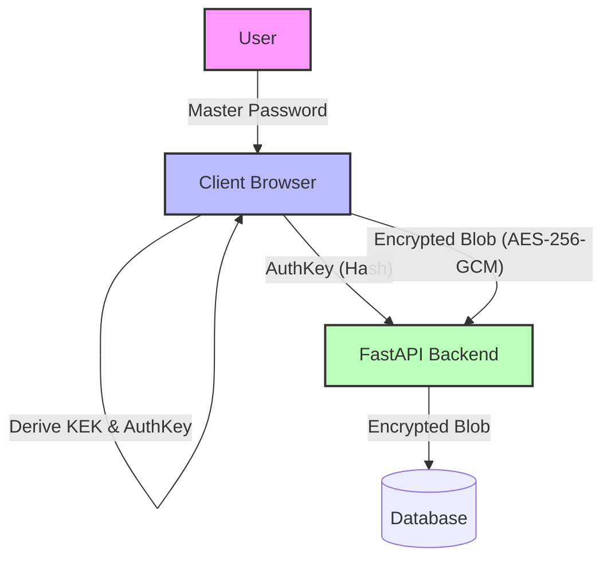

# ValutX - Next-Generation Zero-Knowledge Password Manager

> **Status:** 🚧 **In Active Development** (MVP Complete. Refining Advanced Security Features)

## 🛡️ Project Overview

ValutX is a security-first, full-stack web application that demonstrates a **Zero-Knowledge Architecture**. Unlike traditional web apps, ValutX performs all cryptographic operations (Encryption, Decryption, Key Derivation) entirely in the browser. 

**The server never sees:**
- Your Master Password
- Your Encryption Keys
- Your Plaintext Data (Passwords, Cards, Notes, IDs)

The backend acts solely as a "blind" storage provider, synchronizing encrypted data blobs across devices.

## 🚀 Core Features

-   **Zero-Knowledge Security:** Data is encrypted/decrypted only on the client device using the **Web Crypto API**.
-   **Tactical Cyber Aesthetics:** A premium, high-security terminal aesthetic featuring "Cyber-Noir" and "Industrial Stealth" elements, glassmorphism, and scanline overlays.
-   **Military-Grade Encryption:** Uses **AES-256-GCM** for data blobs and **PBKDF2** for robust key derivation.
-   **Entropy Forge (Password Generator):** Advanced password generation with real-time entropy analysis (bits of security) and "Tactical Grade" strength indicators.
-   **Protocol Rotation:** Secure Master Password changes that re-encrypt the Data Encryption Key (DEK) without losing access to your vault.
-   **Panic Protocol:** A dedicated "Kill Switch" to instantly purge all decrypted data from memory and terminate the session.
-   **Smart Clipboard Safeguards:** Automatic clipboard clearing after 30 seconds to prevent sensitive data exposure.
-   **Data Sovereignty:** Built-in Export/Import tools for maintaining local encrypted backups as JSON archives.

## 🛠️ Tech Stack

### Frontend (Client-Side)
-   **Framework:** React 18 + Vite
-   **Language:** TypeScript
-   **Styling:** Tailwind CSS + Custom Design System
-   **Cryptography:** Web Crypto API (Native Browser Standards)
-   **State:** Zustand (Transient secure memory storage)

### Backend (Server-Side)
-   **Framework:** FastAPI (Python 3.10+)
-   **Database:** SQLite (with SQLAlchemy ORM)
-   **Authentication:** JWT (Access/Refresh Tokens) - *Authenticated via independent Auth Key*
-   **Validation:** Pydantic

## 🏗️ Architecture

The system follows a "Thick Client" cryptography model:



### Key Management Flow
1.  **Identity Derivation:** Master Password + Salt results in two distinct keys:
    -   **Auth Key:** Used for session authentication (hashed again on server).
    -   **KEK (Key Encryption Key):** Used only to unwrap the DEK.
2.  **Data Isolation:**
    -   **DEK (Data Encryption Key):** A random AES-256 key that encrypts all vault items. Stored as an "Encrypted Blob" wrapped by the KEK.
3.  **Memory Security:** Decrypted items reside only in React/Zustand state; the "Panic Mode" triggers a full state purge.

## 📂 Project Structure

```bash
ValutX/
├── frontend/        # React + Vite Frontend
│   ├── src/
│   │   ├── components/  # EntropyForge, Modals, Tactical UI
│   │   ├── pages/       # Dashboard, Setup, Auth, Unlock
│   │   ├── store/       # vaultStore.ts (Memory Management)
│   │   ├── utils/       # crypto.ts (Core WebCrypto Logic)
│   │   └── App.tsx
│   ├── public/
│   └── package.json
├── backend/         # FastAPI Backend
│   ├── app/
│   │   ├── api/         # v1/endpoints (auth, vault)
│   │   ├── core/        # Security & Config
│   │   ├── models/      # SQLAlchemy User & Vault schemas
│   │   └── schemas/     # Pydantic validation
│   ├── main.py      
│   └── requirements.txt
├── ARCHITECTURE.md
└── README.md
```

## ⚡ Getting Started

### Prerequisites
-   Node.js 18+
-   Python 3.10+

### 1. Frontend Setup
```bash
cd frontend
npm install
npm run dev
```

### 2. Backend Setup
```bash
cd backend
python -m venv venv
source venv/bin/activate  # On Windows: venv\Scripts\activate
pip install -r requirements.txt
uvicorn main:app --reload
```

## ⚠️ Disclaimer

This is a **Portfolio / Reference Implementation** intended to demonstrate advanced security concepts. While it uses industry-standard algorithms (AES-GCM, PBKDF2), production use requires formal security audits, Web Assembly implementations of Argon2, and more rigorous memory handling techniques.
