# ValutX - Next-Generation Zero-Knowledge Password Manager

<div align="center">


**Secure. Stealthy. Sovereign.**
*The ultimate tactical vault for your digital identity.*

</div>

---

## 🛡️ The Zero-Knowledge Promise

**ValutX** is a security-first, full-stack web application built on the principle of absolute privacy. Unlike traditional password managers, ValutX implements a **Thick Client Cryptography** model where the server is completely "blind" to your secrets.

- **Zero-Trust Storage:** All data is encrypted using AES-256-GCM before it ever leaves your browser.
- **Client-Side Derivation:** Master passwords never travel over the wire. Keys are derived locally using PBKDF2.
- **Privacy by Design:** The backend stores only opaque, encrypted blobs and handles authentication via independent salt-derived hashes.

---

## ⚡ Tactical Features

### 🛠️ Elite Security
- **Military-Grade Encryption:** AES-256-GCM authenticated encryption for all vault items (Passwords, Identities, Notes).
- **Entropy Forge:** A high-precision password generator with real-time bit-strength analysis and tactical indicators.
- **Protocol Rotation:** Securely update your Master Password via re-wrapping protocols without losing data.
- **Smart Clipboard:** Auto-purging clipboard logic to minimize sensitive data footprint (30s TTL).

### 🖥️ Tactical UI/UX
- **Industrial Stealth Theme:** A premium "Cyber-Noir" interface featuring high-contrast amber accents, glassmorphism, and scanline overlays.
- **Panic Protocol:** A dedicated kill-switch that instantly purges all decrypted data from memory and terminates the session.
- **Fluid Workflows:** Intuitive management of disparate secret types with modular vault components.

---

## 🏗️ Technical Architecture

ValutX operates on a unique dual-key derivation system to ensure the server cannot decrypt your data even if it's compromised.

```mermaid
graph TD
    User["👤 User (Master Password)"] --> KDF["⚙️ PBKDF2 (Client)"]
    KDF --> AuthKey["🔑 Auth Key (Session Control)"]
    KDF --> KEK["🔑 KEK (Key Encryption Key)"]
    
    KEK -->|Unwraps| DEK["📦 DEK (Data Encryption Key)"]
    DEK -->|Encrypts/Decrypts| Secrets["🔒 Private Data"]
    
    AuthKey -->|Hashed| API["🌐 FastAPI Backend"]
    API -->|Stores| Blob["🗄️ Encrypted Blobs (SQLite)"]
    
    style User fill:#0a0a0a,stroke:#FF9D00,color:#fff
    style KDF fill:#1a1a1a,stroke:#00D1FF,color:#fff
    style Secrets fill:#0a4a0a,stroke:#00FFA3,color:#fff
    style API fill:#1a1a1a,stroke:#00D1FF,color:#fff
```



### Key Management Flow
1. **Separation of Concerns:** From your Master Password, we derive an *Auth Key* for logging in and a *KEK* for data access. They are cryptographically distinct.
2. **Data Isolation:** The *DEK* stays wrapped until you unlock the vault. Decrypted items reside only in transient memory (`Zustand` state).
3. **Session Purging:** Any logout or inactivity trigger wipes the state, leaving NO traces of your secrets in the browser's RAM.

---

## 📂 Project Anatomy

```bash
ValutX/
├── frontend/           # React 18 + Vite (Tailwind CSS)
│   ├── src/
│   │   ├── components/ # EntropyForge, PanicBtn, TacticalModals
│   │   ├── utils/      # crypto.ts (The WebCrypto brain)
│   │   └── store/      # vaultStore.ts (Transient memory management)
├── backend/            # FastAPI + Python 3.10
│   ├── app/
│   │   ├── api/        # Secure endpoints (auth/vault)
│   │   └── core/       # Pydantic models & logic
└── ARCHITECTURE.md     # Deep-dive security specs
```

---

## 🚀 Deployment & Setup

### Prerequisites
- **Node.js 18+**
- **Python 3.10+**

### 1️⃣ Pulse Check (Backend)
```bash
cd backend
python -m venv venv
source venv/bin/activate  # Windows: venv\Scripts\activate
pip install -r requirements.txt
uvicorn main:app --reload
```

### 2️⃣ Interface Activation (Frontend)
```bash
cd frontend
npm install
npm run dev
```

---

## ⚠️ Security Disclaimer

ValutX is a **Portfolio / Reference Implementation** designed to showcase advanced cryptographic workflows. While it uses industry-standard algorithms (AES-GCM, PBKDF2), production environments require additional audits, hardened memory handling, and WebAssembly-based Argon2 implementations for maximum entropy protection.

---
<div align="center">
Built with ⚡ by ValutX Security Lab
</div>
